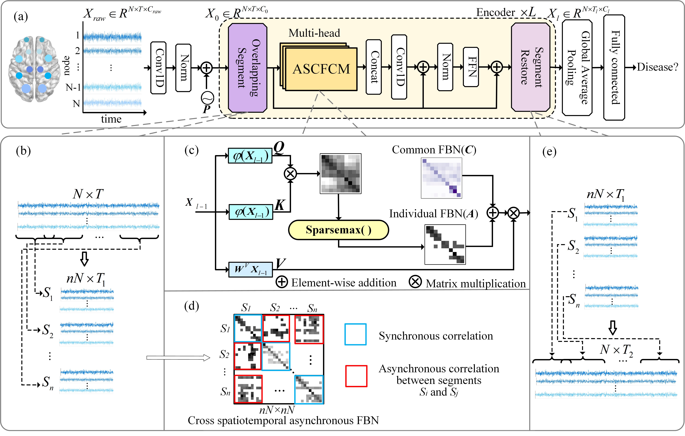

# CrossKT: Learning Asynchronous Common and Individual Functional Brain Network for AD Diagnosis (MICCAI 2023)

# Overview

This code is for the paper: Learning Asynchronous Common and Individual Functional Brain Network for AD Diagnosis (MICCAI 2023). 
The data used in the experiments are from ADNI datasets (https://adni.loni.usc.edu/).
 
# Quick start
Before training the model, please configure the dependencies in the `requirements.txt`.

Train and test the program by `main.py --config config`.

Please note that the synthetic data are provided only to facilitate running the code and release of the original data used in the paper is out of the authority of the author. Please refer to the corresponding data resource for actual evaluation.

# Citation
If you use our method or any part of it in your research, please cite:

@inproceedings{ACIFBN,
    title={Learning Asynchronous Common and Individual Functional Brain Network for AD Diagnosis},
    author={Jianjia Zhang，Xiang Tang，Xiaocai Zhang，Mengting Liu，Dinggang Shen},
    booktitle={26th International Conference on Medical Image Computing and Computer Assisted Intervention(MICCAI)，October 8-12, 2023，Vancouver，Canada.},
    year={2023}
}
